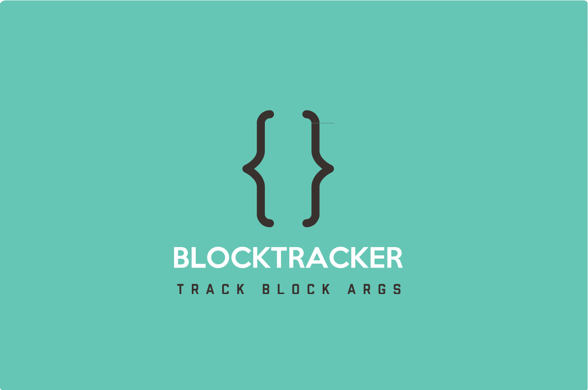

<p align="center">
<a href="https://github.com/yulingtianxia/BlockTracker">

</a>
</p>

[](https://travis-ci.org/yulingtianxia/BlockTracker)
[](https://github.com/Carthage/Carthage)
[](https://github.com/yulingtianxia/BlockTracker/releases)
[](https://twitter.com/yulingtianxia)

# BlockTracker

BlockTracker can track block arguments of a method. It's based on [BlockHook](https://github.com/yulingtianxia/BlockHook).

## 📚 Article

[追踪 Objective-C 方法中的 Block 参数对象](http://yulingtianxia.com/blog/2018/03/31/Track-Block-Arguments-of-Objective-C-Method/)

## 🌟 Features

- [x] Easy to use.
- [x] Keep your code clear.
- [x] Let you modify return value and arguments.
- [x] Trace all block args of method.
- [x] Trace all `NSMallocBlock`.
- [x] Self-managed trackers.
- [x] Support CocoaPods & Carthage.

## 🔮 Example

The sample project "BlockTrackerSample" just only support iOS platform.

## 🐒 How to use

### Track blocks in method
You can track blocks in arguments. This method returns a `BTTracker` instance for more control. You can `stop` a `BTTracker` when you don't want to track it anymore.

```
- (void)viewDidLoad {
    [super viewDidLoad];
    // Begin Track
    __unused BTTracker *tracker = [self bt_trackBlockArgOfSelector:@selector(performBlock:) callback:^(id  _Nullable block, BlockTrackerCallbackType type, void * _Nullable * _Null_unspecified args, void * _Nullable result, NSString * _Nullable mangleName) {
        switch (type) {
            case BlockTrackerCallbackTypeBefore:
                NSLog(@"Before block:%@, mangleName:%@", block, mangleName);
                break;
            case BlockTrackerCallbackTypeAfter:
                NSLog(@"After block:%@, mangleName:%@", block, mangleName);
                break;
            case BlockTrackerCallbackTypeDead:
                NSLog(@"Block Dead! mangleName:%@", mangleName);
                break;
            default:
                break;
        }
    }];
    // invoke blocks
    __block NSString *word = @"I'm a block";
    [self performBlock:^{
        NSLog(@"add '!!!' to word");
        word = [word stringByAppendingString:@"!!!"];
    }];
    [self performBlock:^{
        NSLog(@"%@", word);
    }];
    // stop tracker in future
//    [tracker stop];
    // blocks will die
}

- (void)performBlock:(void(^)(void))block {
    block();
}

@end
```

Here is the log:

```
add '!!!' to word
BlockTrackerCallbackTypeInvoke invoke count = 1
I'm a block!!!
BlockTrackerCallbackTypeInvoke invoke count = 1
BlockTrackerCallbackTypeDead invoke count = 1
BlockTrackerCallbackTypeDead invoke count = 1
```

### Track a batch of blocks.

```
setMallocBlockCallback(^(id  _Nullable block, BlockTrackerCallbackType type, void * _Nullable * _Null_unspecified args, void * _Nullable result, NSString * _Nullable mangleName) {
    NSLog(@"type: %lu, mangleName: %@", (unsigned long)type, mangleName);
});
```

## 📲 Installation

### CocoaPods

[CocoaPods](http://cocoapods.org) is a dependency manager for Cocoa projects. You can install it with the following command:

```bash
$ gem install cocoapods
```

To integrate BlockTracker into your Xcode project using CocoaPods, specify it in your `Podfile`:


```
source 'https://github.com/CocoaPods/Specs.git'
platform :ios, '8.0'
use_frameworks!
target 'MyApp' do
	pod 'BlockTracker'
end
```

You need replace "MyApp" with your project's name.

Then, run the following command:

```bash
$ pod install
```

### Carthage

[Carthage](https://github.com/Carthage/Carthage) is a decentralized dependency manager that builds your dependencies and provides you with binary frameworks.

You can install Carthage with [Homebrew](http://brew.sh/) using the following command:

```bash
$ brew update
$ brew install carthage
```

To integrate BlockTracker into your Xcode project using Carthage, specify it in your `Cartfile`:

```ogdl
github "yulingtianxia/BlockTracker"
```

Run `carthage update` to build the framework and drag the built `BlockTrackerKit.framework` into your Xcode project.

### Manual

Just drag source files in `BlockTracker` folder to your project.

## ❤️ Contributed

- If you **need help** or you'd like to **ask a general question**, open an issue.
- If you **found a bug**, open an issue.
- If you **have a feature request**, open an issue.
- If you **want to contribute**, submit a pull request.

## 👨🏻‍💻 Author

yulingtianxia, yulingtianxia@gmail.com

## 👮🏻 License

BlockTracker is available under the MIT license. See the LICENSE file for more info.

